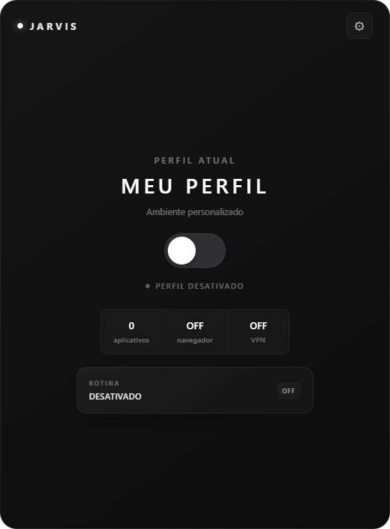
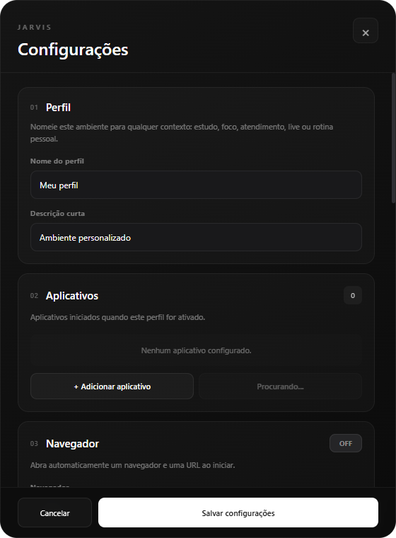
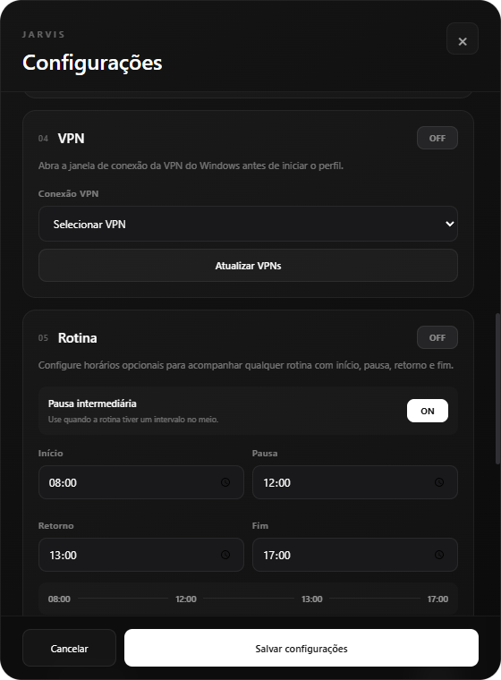
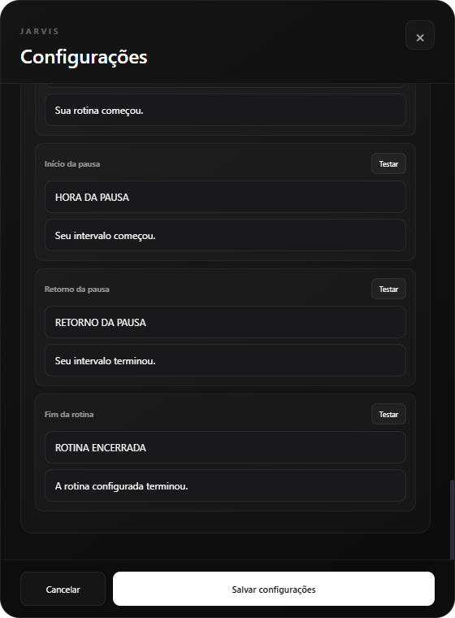

# JARVIS


JARVIS é um aplicativo desktop para Windows que automatiza a preparação de ambientes de uso.

Ele permite configurar um perfil com aplicativos, navegador, URL inicial, VPN e rotina de horários. Ao ativar esse perfil, o app executa as ações configuradas e acompanha o estado da rotina em uma interface única.

## Por Que Existe

Iniciar uma atividade costuma envolver pequenas tarefas repetitivas: abrir os mesmos aplicativos, acessar uma página específica, conectar uma VPN e lembrar os horários da rotina. O JARVIS transforma esse preparo em um fluxo configurável.

O projeto não depende de um contexto pessoal específico. Um perfil pode representar um ambiente de trabalho, estudo, atendimento, live, manutenção ou qualquer rotina que precise ser iniciada de forma consistente.

## Funcionalidades

- Configuração de perfil com nome e descrição.
- Seleção manual de aplicativos executáveis.
- Detecção de aplicativos a partir do Menu Iniciar do Windows.
- Inicialização automática dos aplicativos configurados.
- Seleção de navegador detectado no sistema.
- Abertura automática de uma URL inicial.
- Detecção de conexões VPN do Windows.
- Integração com VPN usando ferramentas nativas do Windows.
- Rotina opcional com início, pausa, retorno e encerramento.
- Pausa intermediária opcional.
- Suporte a rotinas que atravessam a meia-noite.
- Notificações personalizadas para eventos da rotina.
- Persistência local das configurações.
- Encerramento apenas dos processos iniciados pelo próprio JARVIS.
- Exibição de avisos quando parte do perfil falha ao iniciar ou encerrar.

## Fluxo De Uso

Ao ativar um perfil, o JARVIS:

1. valida a configuração atual;
2. solicita/conecta a VPN configurada, quando habilitada;
3. abre o navegador com a URL inicial, quando habilitado;
4. inicia os aplicativos configurados;
5. ativa o acompanhamento da rotina, quando habilitado;
6. mostra avisos caso alguma etapa falhe parcialmente.

Ao desativar o perfil, o app tenta desconectar a VPN configurada e encerrar os processos que foram iniciados por ele durante aquela sessão.

## Screenshots

<p align="center">
  
  
</p>

<p align="center">
  
  
</p>

## Arquitetura

O projeto é dividido entre o processo principal do Electron, a interface em React e um preload script que controla a comunicação entre os dois lados.

```text
JARVIS
├── electron/
│   ├── main.cjs       # Janelas, IPC, processos, VPN, notificações e persistência
│   └── preload.cjs    # API controlada exposta ao renderer
├── src/
│   ├── App.tsx        # Orquestração da interface e fluxo de ativação
│   ├── config.ts      # Configuração padrão e normalização no renderer
│   ├── time.ts        # Cálculo da rotina e validação de horários
│   ├── components/    # Componentes visuais da aplicação
│   └── *.test.ts      # Testes unitários
├── public/            # Ícones estáticos
├── scripts/           # Scripts auxiliares de execução
└── package.json       # Scripts, dependências e configuração de empacotamento
```

### Electron Main Process

O arquivo `electron/main.cjs` concentra as integrações com o sistema operacional. Ele cria as janelas, registra os handlers IPC, salva e carrega a configuração local, detecta aplicativos e navegadores, interage com VPNs do Windows e agenda notificações.

Também é nele que os processos iniciados pelo JARVIS são rastreados por PID. Isso permite que a desativação do perfil tente encerrar apenas o que o próprio aplicativo abriu, reduzindo o risco de fechar programas que o usuário já estava usando antes.

### React Renderer

A interface fica em `src/`. O `App.tsx` coordena o estado principal, a abertura do painel de configurações, o fluxo de ativação/desativação e a exibição de avisos. Os componentes em `src/components/` cuidam da tela de configurações, contador da rotina, editor de mensagens e janela de notificação.

### Preload E IPC

O `electron/preload.cjs` expõe uma API limitada em `window.jarvis`. O renderer não acessa APIs Node.js diretamente; ele chama métodos controlados que passam pelo IPC do Electron.

## Segurança

O projeto usa algumas medidas de endurecimento comuns em aplicações Electron:

- `contextIsolation` ativado.
- `nodeIntegration` desativado.
- `sandbox` ativado nas janelas.
- `webSecurity` ativado.
- Content Security Policy definida no HTML.
- Bloqueio de `window.open`.
- Bloqueio de navegação para fora da origem esperada.
- API do preload limitada às ações necessárias.
- Sanitização de configurações antes de salvar ou executar ações.
- Validação de caminhos executáveis, URLs HTTP/HTTPS e nomes de VPN.
- Encerramento de processos baseado em PIDs rastreados.

Esses mecanismos não tornam o app seguro de forma absoluta, mas reduzem a superfície de exposição entre interface, Electron e sistema operacional.

## Persistência Local

As configurações são salvas em um arquivo `config.json` dentro do diretório `userData` do Electron, em uma subpasta `JARVIS`.

No desenvolvimento, o projeto isola esse diretório em `.jarvis-dev/user-data` para evitar conflitos com o cache do Electron e com instalações locais do aplicativo.

## Rotina E Notificações

A rotina é opcional e pode ser configurada com:

- horário de início;
- horário de pausa;
- horário de retorno;
- horário de encerramento.

A pausa intermediária pode ser desativada. Quando isso acontece, a rotina passa a considerar apenas início e fim. A lógica de tempo também aceita rotinas que atravessam a meia-noite, como um período começando à noite e terminando na manhã seguinte.

As notificações podem ter mensagens personalizadas por evento e duração configurável.

## Tecnologias

- Electron
- React
- Vite
- TypeScript
- Vitest
- Oxlint
- Electron Builder
- APIs nativas do Windows: atalhos do Menu Iniciar, `rasphone.exe`, `rasdial.exe` e `taskkill`

## Pré-Requisitos

- Windows
- Node.js compatível com as dependências do projeto
- npm

## Como Rodar

Instale as dependências:

```bash
npm install
```

Inicie em modo desenvolvimento:

```bash
npm run dev
```

## Build E Distribuição

Gere o build web usado pelo Electron:

```bash
npm run build
```

Gere o instalador Windows:

```bash
npm run dist
```

O instalador é criado em:

```text
release/
```

## Qualidade

Scripts disponíveis:

```bash
npm run typecheck
npm run lint
npm run test
npm run build
npm run dist
npm audit
```

Os testes unitários atuais cobrem:

- normalização de configurações salvas;
- preenchimento de valores padrão;
- rejeição de valores malformados;
- cálculo da rotina com pausa;
- cálculo da rotina sem pausa;
- rotinas que atravessam a meia-noite;
- validação de horários inválidos.

## Decisões Técnicas

- Electron foi usado para permitir uma interface desktop com acesso controlado a recursos do Windows.
- React concentra a experiência visual e o estado da interface.
- O preload evita que o renderer acesse Node.js diretamente.
- A comunicação IPC separa comandos de sistema da interface.
- A configuração é normalizada tanto no renderer quanto no processo principal.
- O gerenciamento de processos usa PIDs armazenados durante a ativação do perfil.
- A rotina trabalha com segundos do dia e normalização de horários para lidar com virada de meia-noite.

## Desafios Do Projeto

- Integrar React e Electron mantendo uma fronteira clara entre UI e sistema operacional.
- Detectar aplicativos instalados no Windows a partir de atalhos do Menu Iniciar.
- Interagir com VPNs usando ferramentas nativas sem armazenar credenciais.
- Tratar rotinas que atravessam a meia-noite sem quebrar o contador.
- Encerrar processos iniciados pelo app sem afetar programas abertos manualmente pelo usuário.

## Roadmap

- [ ] Suporte a múltiplos perfis.
- [ ] Importação e exportação de configurações.
- [ ] Ícone próprio para o executável e instalador.
- [x] Screenshots versionadas da interface.
- [ ] Testes de integração para fluxos Electron/IPC.
- [ ] Atualização automática.

## Autor

Gustavo Pontes da Silva
